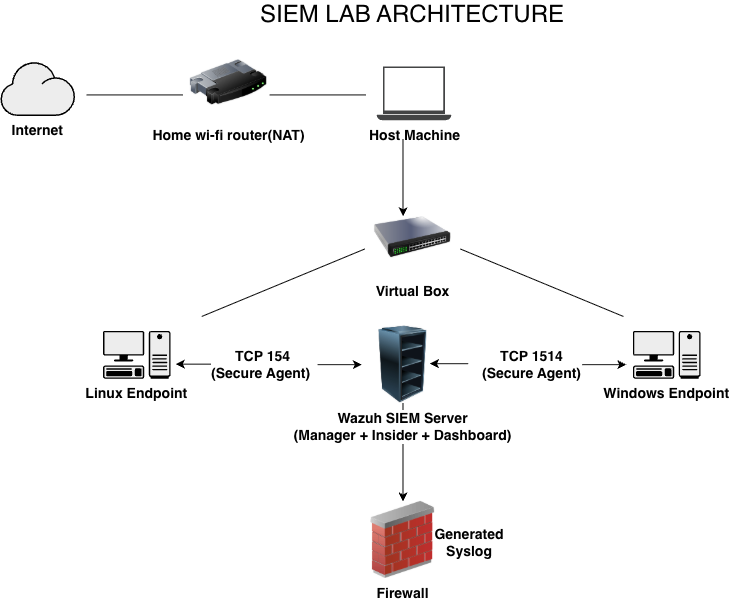
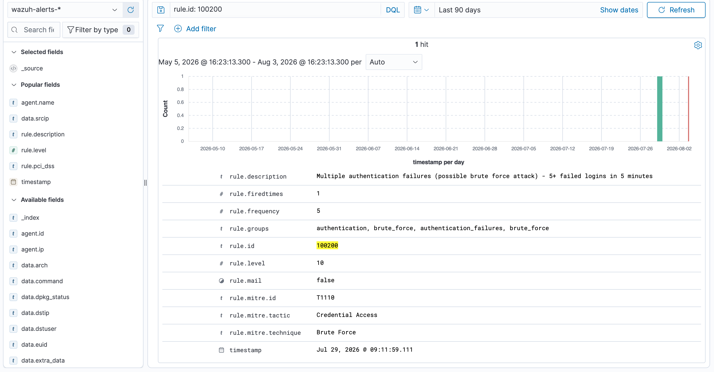
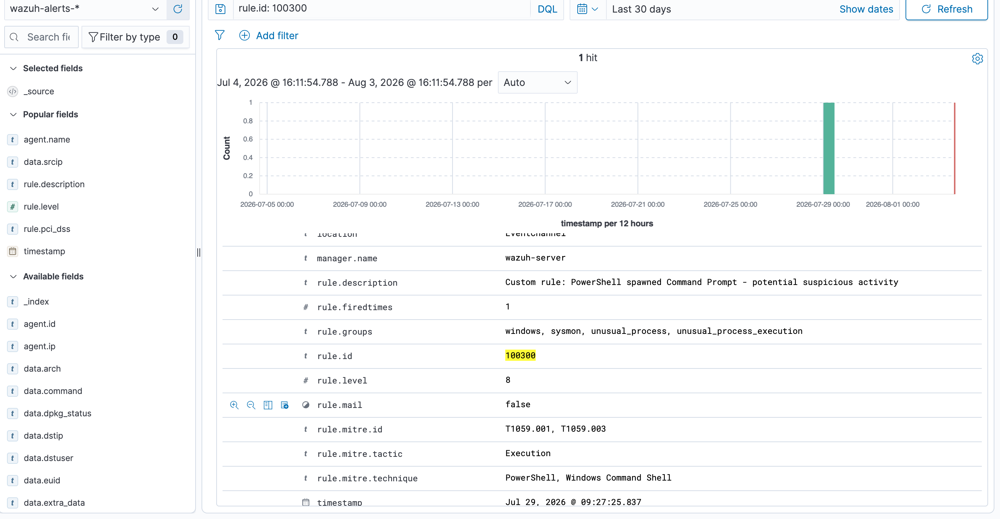
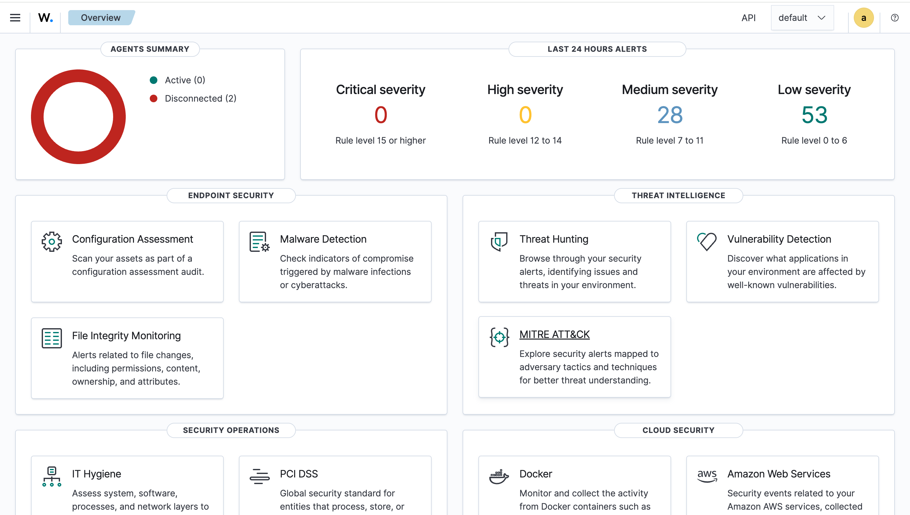
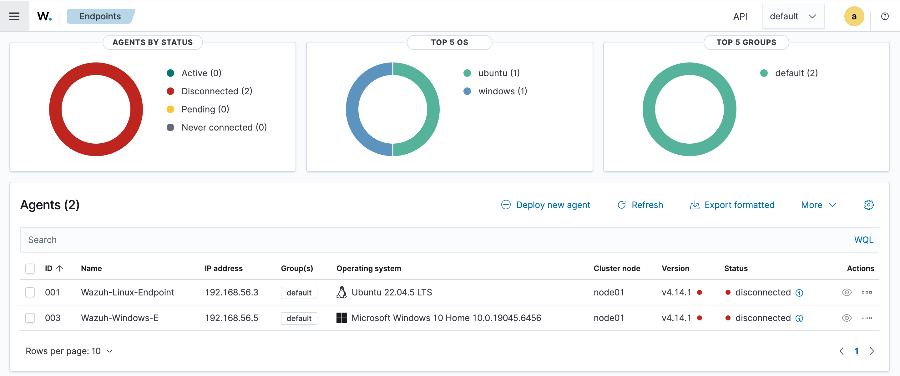
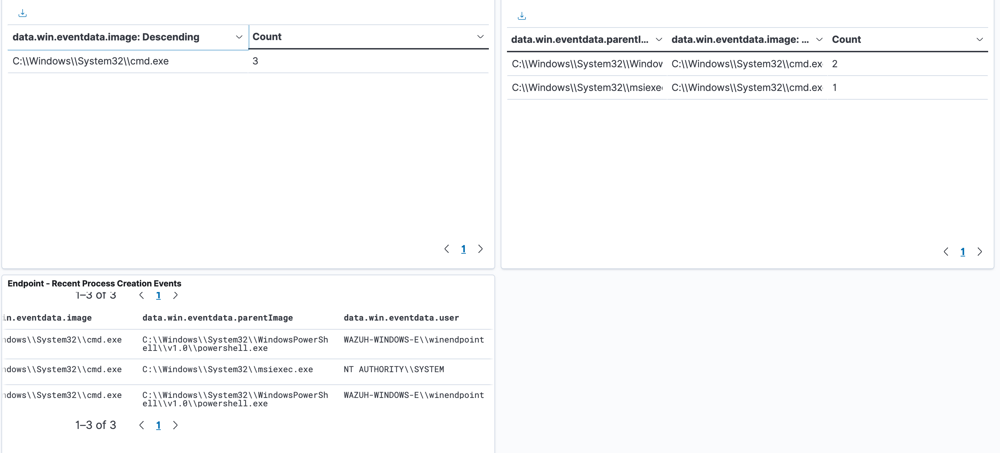
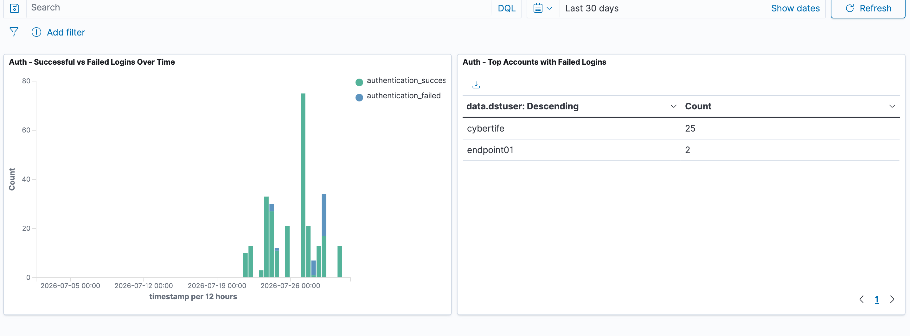
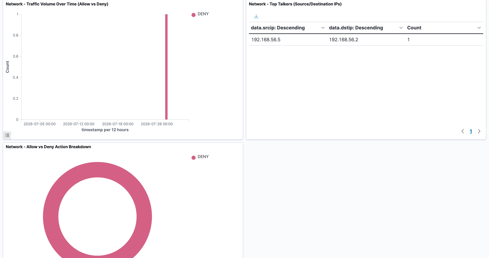
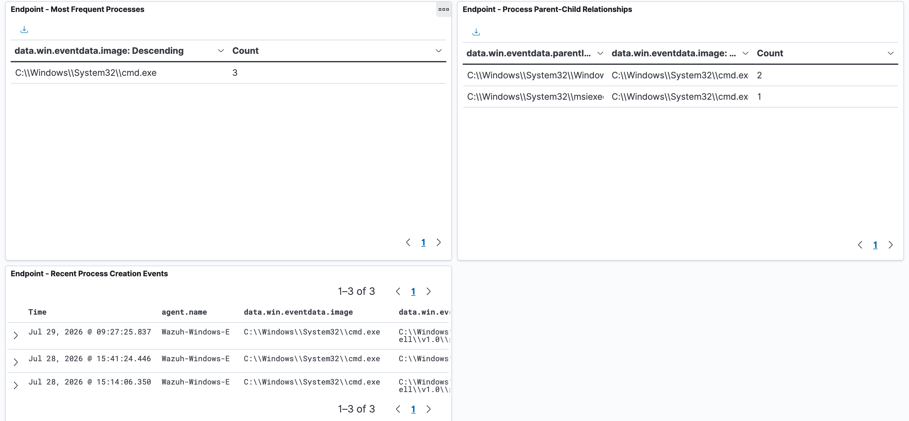

# 🛡️ Wazuh SIEM Lab – Multi-Source Security Monitoring with Custom Detection Rules

A hands-on Security Information and Event Management (SIEM) lab built using **Wazuh** to simulate the day-to-day workflow of a Security Operations Center (SOC) Analyst.

The lab collects logs from multiple endpoints, visualizes security events through dashboards, and detects suspicious behaviour using custom correlation rules.

---

# 📑 Table of Contents

- Project Overview
- Objectives
- Lab Architecture
- Lab Environment
- Log Sources
- Detection Rules
- Dashboards
- Challenges
- Skills Demonstrated
- Future Improvements
- Documentation

---

# 📌 Project Overview

This project demonstrates the deployment of a fully functional SIEM environment using **Wazuh**.

The environment centralizes security logs from multiple sources, allowing events to be collected, analysed, visualized and investigated from a single platform.

To simulate the work of a SOC Analyst, I:

- Deployed a Wazuh SIEM server
- Connected multiple log sources
- Created security dashboards
- Built custom detection rules
- Investigated authentication events
- Monitored suspicious system activity

The project focuses on detecting real-world attack techniques including brute-force authentication attempts and Living-off-the-Land Binary (LOLBins) execution.

---

# 🎯 Objectives

- Deploy a fully functional Wazuh SIEM
- Collect logs from multiple operating systems
- Centralize security monitoring
- Build SOC investigation dashboards
- Create custom detection rules
- Investigate suspicious authentication events

---

# 🏗️ Lab Architecture

---

# 💻 Lab Environment

| Component | Technology |
|------------|------------|
| SIEM Platform | Wazuh |
| Server OS | Ubuntu Server 22.04 |
| Endpoint | Windows |
| Endpoint | Linux |
| Firewall | Simulated Firewall Logs |
| Virtualization | UTM (Apple Silicon) |
| Dashboard | Wazuh Dashboard |

---

# 📥 Log Sources

The SIEM collected logs from three independent sources.

| Source | Purpose |
|---------|----------|
| Windows Endpoint | Security Event Logs |
| Linux Endpoint | System Logs |
| Simulated Firewall | Network Traffic Logs |

---

# 🚨 Custom Detection Rules

## Rule 100200

**Multiple Authentication Failures**

Detects possible brute-force attacks by triggering when **five failed login attempts occur within five minutes.**

Screenshot:

---

## Rule 10300

**Living-off-the-Land Binary (LOLBins) Detection**

Detects suspicious execution of trusted Windows binaries commonly abused by attackers.

Screenshot:

---

# 📊 Dashboards

## SIEM Dashboard Overview

---

## Agent Overview

Displays connected agents and their health.

---

## Agent Details

Shows endpoint information collected by Wazuh.

---

## Windows Event Monitoring

Security events collected from Windows.

---

## Authentication Dashboard

Visualizes successful and failed login attempts.

---

## Network Traffic Dashboard

Displays network traffic over time.

---

## Most Frequent Processes

Shows the processes most commonly executed on monitored endpoints.

---

# 🔍 Key Findings

- Successfully centralized logs from multiple systems.
- Authentication events were easy to investigate through custom dashboards.
- Custom correlation rules generated alerts for suspicious behaviour.
- Wazuh provided excellent visibility across monitored endpoints.
- Dashboards significantly improved event investigation.

---

# ⚠️ Challenges Encountered

During this project I experienced several real-world deployment challenges:

- Running multiple virtual machines on limited hardware resources.
- Resolving Wazuh Manager startup timeout caused by the default `systemd` timeout.
- Integrating multiple log sources into a single SIEM platform.
- Creating detection rules that minimized false positives.
- Designing dashboards that clearly displayed meaningful security events.

Resolving these issues improved my troubleshooting skills and deepened my understanding of SIEM deployment and monitoring.

---

# 🛠️ Skills Demonstrated

- Security Information and Event Management (SIEM)
- Wazuh Deployment
- Ubuntu Server Administration
- Windows Event Monitoring
- Linux Log Collection
- Firewall Log Analysis
- Security Dashboards
- Detection Engineering
- Correlation Rule Creation
- Security Monitoring
- Threat Detection
- Log Analysis
- SOC Investigation

---

# 🚀 Future Improvements

If additional time and resources were available, I would:

- Add a dedicated pfSense firewall VM.
- Enable permanent Linux endpoint monitoring.
- Integrate DNS query logging.
- Improve brute-force detection to identify credential spraying.
- Build a MITRE ATT&CK coverage dashboard.

---

# 📄 Documentation

Project Report

- SIEM Lab Project Report (PDF)

Presentation

- SIEM Lab Presentation (PowerPoint)

---

# 👨‍💻 About Me

I am transitioning into Cybersecurity with a focus on becoming a Security Operations Center (SOC) Analyst.

I enjoy building hands-on labs, investigating security events, and documenting my learning journey through practical projects.

Feel free to connect with me on LinkedIn or explore my other cybersecurity projects.

---

# 👤 Author

**Boluwatife Makinde**

Aspiring SOC Analyst | Cybersecurity Enthusiast | Former Product Designer transitioning into Blue Team operations.

LinkedIn:

www.linkedin.com/in/boluwatife-makinde-571ba3378

GitHub:

https://github.com/CyberTife

