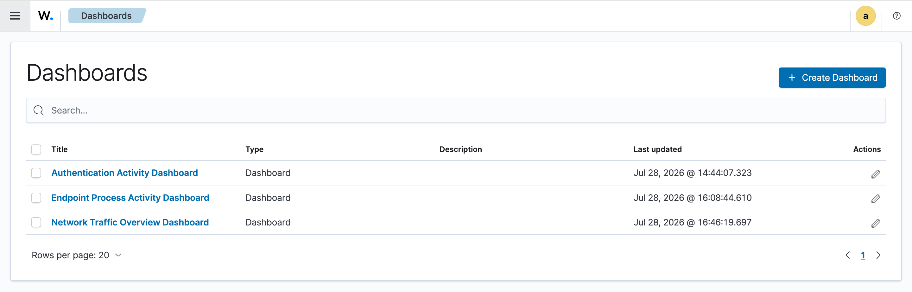

# 🛡️ Wazuh SIEM Lab – Multi-Source Security Monitoring with Custom Detection Rules

## 📌 Project Overview

This project documents the design and implementation of a Security Information and Event Management (SIEM) lab using **Wazuh**.

The lab centralizes security events from multiple log sources, visualizes activity through dashboards, and detects suspicious behaviour using custom correlation rules.

The objective was to simulate how a SOC Analyst monitors endpoints, investigates events, and creates detections for potential attacks.

---

## 🎯 Objectives

- Deploy a fully functional Wazuh SIEM
- Collect logs from multiple sources
- Build useful SOC dashboards
- Create custom detection rules
- Simulate attacker behaviour
- Investigate alerts generated by Wazuh

---

# 🏗️ Lab Architecture

The environment consists of:

- Ubuntu Server (Wazuh Manager)
- Windows Endpoint
- Linux Endpoint
- Simulated Firewall Log Source

## Architecture Diagram

---

# 🖥️ Log Sources

The SIEM collects events from three different sources.

| Source | Events Collected |
|---------|------------------|
| Windows Endpoint | Security Events, Authentication Logs, Process Creation |
| Linux Endpoint | Syslog, Authentication Logs |
| Firewall (Simulated) | Network Traffic, Allow/Deny Events |

---

# 📊 Dashboard Overview

## Wazuh Dashboard

---

## Agent Overview

Shows connected endpoints reporting logs to Wazuh.

---

## Windows Event Data

Windows authentication and security events collected by Wazuh.

---

## Traffic Volume Over Time

Visualizes incoming events over time.

---

## Authentication Dashboard

Successful vs failed logins.

---

## Most Frequent Processes

Displays commonly executed processes on monitored endpoints.

---

# 🚨 Detection Rules

Two custom correlation rules were created to simulate SOC detections.

## Rule 100200

### Multiple Failed Logins (Possible Brute Force)

Triggers when:

- Five failed logins
- Same user
- Within five minutes

Screenshot:

---

## Rule 100300

### Living-Off-the-Land (LOLBins)

Detects suspicious execution of legitimate Windows utilities commonly abused by attackers.

Screenshot:

---

# 📈 Skills Demonstrated

- SIEM Deployment
- Wazuh Administration
- Endpoint Monitoring
- Windows Event Log Analysis
- Linux Log Analysis
- Security Monitoring
- Threat Detection
- Custom Rule Creation
- Dashboard Development
- Log Correlation
- Incident Investigation

---

# ⚙️ Technologies Used

- Wazuh
- Ubuntu Server
- Windows
- Linux
- VirtualBox
- Syslog
- JSON
- YAML
- XML

---

# 🧠 Challenges Faced

During this project I encountered several real-world challenges, including:

- Wazuh Manager timing out during startup despite the services running correctly
- Troubleshooting systemd service failures
- Building custom correlation rules that fired reliably
- Configuring multiple log sources
- Creating meaningful dashboards from collected events
- Understanding how Wazuh decoders, rules, and alerts work together

Working through these issues improved my troubleshooting and log analysis skills.

---

# 🚀 Future Improvements

Given additional time, I would:

- Bring the Linux endpoint back online as a permanent log source
- Add real DNS query monitoring
- Deploy pfSense instead of simulated firewall logs
- Expand brute-force detection to include password spraying attacks
- Build a MITRE ATT&CK coverage dashboard

---

# 📄 Documentation

Additional project documentation is available in this repository.

- Project Report
- Presentation Slides

---

# 👨‍💻 Author

**Boluwatife Makinde**

Aspiring SOC Analyst | Defensive Security | Wazuh | SIEM | Threat Detection

LinkedIn:
www.linkedin.com/in/boluwatife-makinde-571ba3378

GitHub:
https://github.com/CyberTife

---
